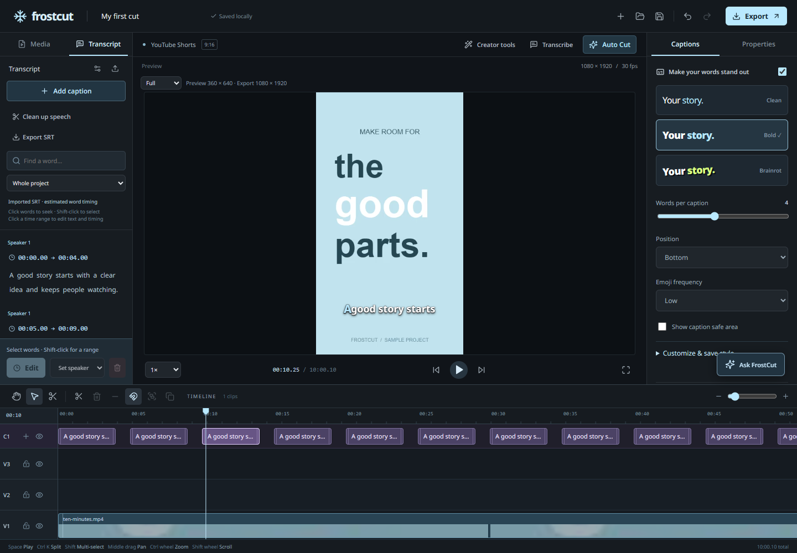

# Lossless editor performance audit — 2026-09-27

The first optimization targets playback in the editor. It does not change speech models,
quantization, audio samples, caption timing, source resolution, export bitrate, or export FPS.

## Options considered

| Approach | Evidence in this application | Trade-off | Decision |
| --- | --- | --- | --- |
| Reduce repeated React work and reuse project-derived caption data | App, timeline and transcript subscribed to the entire Zustand store. Each animation-frame playhead update rebuilt static UI; `captionAt`, `timelineWords` and `transcriptGroups` repeatedly transformed unchanged project data. | Low risk; subscriptions must still follow media refreshes, undo, seeking and project changes. | **Selected and implemented first.** Benefits ordinary editing immediately without modifying inference or encoding. |
| Keep one speech worker/model warm between analysis jobs | `createTranscriber` creates a worker per session; `analyzeSource` disposes it afterward. A model is already reused across all windows **within** that session, and downloaded model files are already cached. | Helps subsequent jobs, not the first long transcription's inference time. Requires model/device keys, bounded idle memory, cancellation and failed-worker recovery. | Worth measuring next for repeated transcriptions. No unmeasured speed-up is claimed. |
| Overlap first model initialization / next audio-window extraction with inference | The 90-second analysis windows currently extract PCM, compute the envelope, then await ASR sequentially. | Preserves samples and decoding settings, but simultaneous FFmpeg and CPU ASR can compete for CPU/RAM. Needs one-window prefetch limit, cancellation, and device-specific measurements. | Defer until extraction vs inference timings show material avoidable waiting. |

Reducing model size, lowering preview resolution, dropping video frames or changing export
quality were excluded. Existing proxy, transcript and silence-envelope caches are already
present; simply proposing those again would not address the observed work.

## Changes

- Select only the state each static panel consumes. A playback tick no longer redraws the
  application shell, property panels or all timeline tracks.
- Isolate the moving playhead and the timeline clock. Keep frame-rate cursor updates, using
  a transform for its position. Read the live playhead when starting an edit or snapping.
- Memoize caption/transcript grouping for the current immutable project. Edits, undo/redo,
  imports, sequence changes and hiding a track supply a new project and refresh the result.
  No process-wide cache retains old projects or trusts mutable source objects.
- Update transcript/strip highlights when active words/blocks change, including simultaneous
  overlapping words and silent gaps. All words and blocks remain mounted and editable.
- Keep the timeline's media-revision subscription so asynchronous thumbnails and waveforms
  still appear. Media insertion reads the current cursor position at the time of the click.

This follows the documented behavior of [Zustand shallow selectors](https://github.com/pmndrs/zustand/blob/main/docs/learn/guides/prevent-rerenders-with-use-shallow.md)
and [React useMemo](https://react.dev/reference/react/useMemo). The alternative speech-worker
lifecycle is informed by [Transformers.js pipeline reuse](https://huggingface.co/docs/transformers.js/tutorials/node).

## Reproducible measurement

`scripts/benchmark-editor.mjs` uses the project's existing Playwright/Edge test stack. It
imports the same synthetic 600-second 360×640 video and 1,440-word SRT, shows the transcript,
selects **Full** preview and **1×** playback, warms up for two seconds, then samples ten
seconds. Each build gets three fresh browser contexts in alternating order. Production
snapshots are served on separate ports, outside `test-results` so other test runners cannot
erase them. No ASR is invoked by this editor benchmark.

The script records Chromium main-thread task/script/layout time, animation-frame gaps,
source dimensions, video dropped-frame counters and browser errors. Results are environment
dependent; animation-frame callbacks are not decoded-video FPS, and main-thread time is not
whole-machine CPU utilization. Concurrent desktop work can affect frame gaps.

```powershell
npx vite build --outDir performance-results/before
# In a separate terminal:
npx vite preview --port 5182 --strictPort --outDir performance-results/before
# After applying the optimization:
npx vite build --outDir performance-results/after
# In a separate terminal:
npx vite preview --port 5183 --strictPort --outDir performance-results/after
# With both previews running:
$env:FROSTCUT_PERF_URLS='http://127.0.0.1:5182,http://127.0.0.1:5183'
node scripts/benchmark-editor.mjs
```

The baseline and optimized bundles have identical speech/translation worker, WASM, vision
and stylesheet asset hashes. The benchmark is an editor workload, not speech-recognition
accuracy, first-download, 4K decoding or export-throughput evidence.

## Results

Raw, per-run evidence: [editor-performance.json](qa/editor-performance.json).
Edge 154.0.4258.37 on this machine; median of three runs per production snapshot:

| Metric | Before | After | Change |
| --- | ---: | ---: | ---: |
| JavaScript execution per second of playback | 656.3 ms | 151.0 ms | **77.0% less** |
| Main-thread task time per second | 998.5 ms | 904.1 ms | **9.5% less** |
| 95th-percentile animation-frame gap | 41.67 ms | 13.89 ms | Shorter gaps |

Frame-gap results varied with concurrent desktop activity (before: 27.78–62.48 ms;
after: 13.88–20.82 ms). JavaScript time was more consistent: 648.9–662.9 ms/s before,
149.6–157.3 ms/s after. This supports reduced editor computation, not a blanket claim that
the entire application or Auto Cut is 77% faster. Both sides retained 1,440 words,
360×640 decoded source video and zero video-decoder dropped frames in these six runs.

The benchmark snapshots include the same concurrent caption/media UI work. Further
typography and keyboard-shortcut work landed during validation; that work is outside this
performance comparison. The benchmark's identical stylesheet/worker hashes refer to the
two measured snapshots, not to every subsequent build in the shared workspace.

## Validation

- TypeScript compilation passed and the production build completed. Vite reports the
  existing single entry chunk now just over its 500 kB advisory threshold; splitting editor
  entry code is a separate startup optimization, not part of this playback change.
- All 89 unit tests passed across 12 files.
- The added playback regression checks backward/forward seeks, highlighted words and
  caption blocks, exact cursor geometry, silence gaps, unchanged saved project data,
  hidden-track cache invalidation and undo.
- Ten focused browser regressions passed, including caption editing, timeline pan/zoom,
  playback speed, trimming, project reload, mobile layout and the new playback-state check.
- Three export checks passed afterward: actual ducked/enhanced audio, manual captions in
  MP4, and imported video with audio/captions. The audio export initially timed out in a
  broader run, then passed without an export-code change. That earlier timeout is not
  treated as a successful full-suite run.
- At the user's request, additional tests were stopped to free resources while gaming.
  No further benchmark, build or test was run after that request. Remaining full-suite
  coverage is intentionally deferred to manual testing; this is **not** a 34/34 suite claim.



## Later lightweight editor work

The follow-up [creator workflow changes](creator-workflow-polish.md) remove active
timeline cloning from each batch-progress render, memoize part duration/size totals,
and commit sequence names once on Enter/blur instead of on every character. They
do not change encoding quality and were not benchmarked. The earlier measurements
above do not apply to these follow-ups. The user subsequently allowed short checks:
type checking and 18 targeted data-only tests passed; browser/render checks remain
deferred while gaming.
